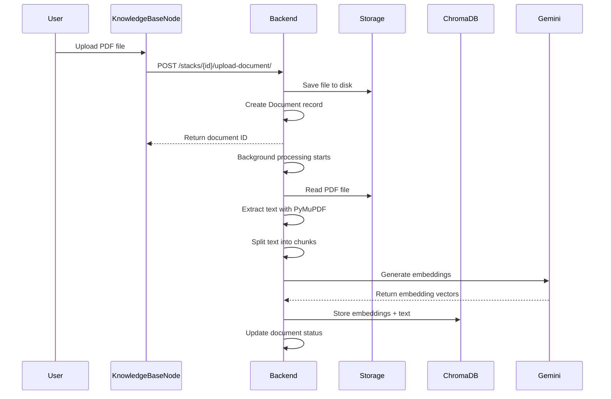
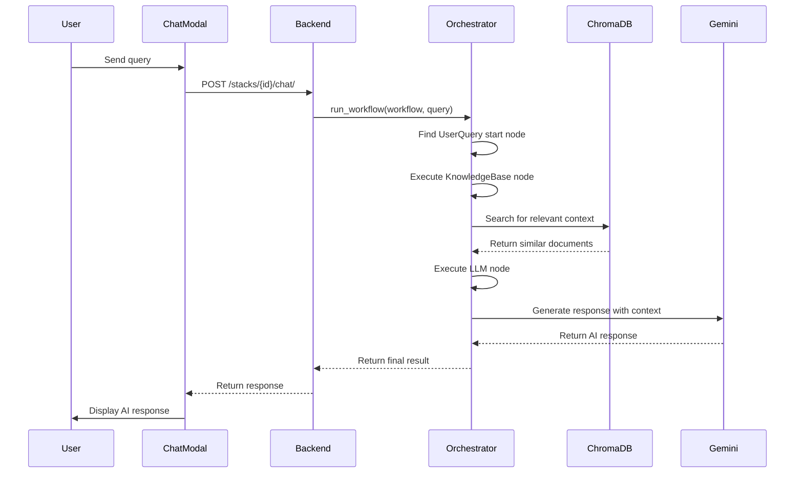

# FlowStack Component Interaction Diagrams

This document provides visual representations of how components interact within the FlowStack architecture.

## Component Interaction Overview

### Frontend Component Hierarchy
```
App.jsx
├── DashboardPage.jsx
│   ├── CreateStackModal.jsx
│   └── (Stack List Display)
│
└── BuilderPage.jsx
    ├── ComponentsPanel.jsx
    │   └── DraggableNode components
    ├── ReactFlow Canvas
    │   ├── UserQueryNode.jsx
    │   ├── LlmEngineNode.jsx  
    │   ├── KnowledgeBaseNode.jsx
    │   └── OutputNode.jsx
    ├── ChatModal.jsx
    └── WorkflowContext.Provider
```

### Backend Module Dependencies
```
main.py (FastAPI App)
├── models.py (SQLAlchemy Models)
├── schemas.py (Pydantic Schemas)  
├── crud.py (Database Operations)
├── database.py (DB Connection)
├── validator.py (Workflow Validation)
├── orchestrator.py (Workflow Execution)
│   ├── llm_handler.py (Gemini Integration)
│   ├── processing.py (Document Processing)
│   └── web_search.py (SerpAPI Integration)
└── External Dependencies
    ├── PostgreSQL Database
    ├── ChromaDB Vector Store
    └── Google Gemini API
```

## Workflow Execution Sequence

### Document Upload and Processing


### Workflow Execution


## Data Flow Patterns

### State Management in Frontend
```
User Interaction → Node Component → WorkflowContext → BuilderPage State
                                                    ↓
                              ReactFlow State → Backend API → Database
```

### API Request/Response Flow
```
Frontend Component → axios → FastAPI Endpoint → Business Logic → Database/External APIs
                                              ↓
Frontend Component ← axios ← JSON Response ← Response Serialization ← Processed Data
```

### Node Configuration Flow
```
User selects node → Node renders config form → User updates settings
                                             ↓
                    WorkflowContext.onUpdateNodeData() → Update nodes state
                                             ↓
                    Auto-save workflow → PUT /stacks/{id}/ → Database update
```

## Error Handling Patterns

### Frontend Error Handling
```
API Call → axios interceptor → Error boundary → User notification
                             ↓
           Fallback UI → Retry mechanism → Recovery action
```

### Backend Error Handling
```
Request → FastAPI endpoint → Business logic → External API call
                           ↓                  ↓ (on error)
        HTTP Error Response ← Error handler ← Exception raised
                           ↓
        Frontend receives error → User notification
```

## Security Boundaries

### API Key Flow
```
User enters API key → Node configuration → Workflow execution context
                                        ↓
                    Temporary usage → External API call → Key discarded
                                   ↓
                    No persistent storage
```

### File Access Control
```
File upload → Stack-specific directory → Background processing
                                      ↓
            Database record with stack_id → Access control by stack ownership
```

## Performance Optimization Points

### Caching Strategies
```
ChromaDB: Vector similarity search caching
PostgreSQL: Query result caching via SQLAlchemy
Frontend: Component state caching via React
Gemini API: Connection pooling and request batching
```

### Async Processing
```
File Upload → Immediate response → Background task queue
                               ↓
            User polling for status → Task completion notification
```

This architectural overview provides a comprehensive understanding of how FlowStack components interact to create a cohesive AI workflow building platform.